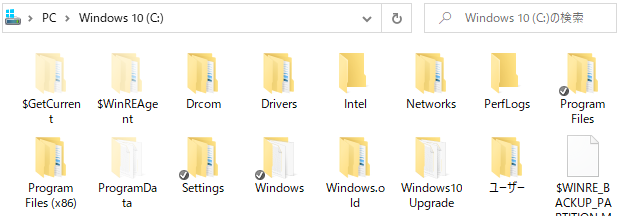
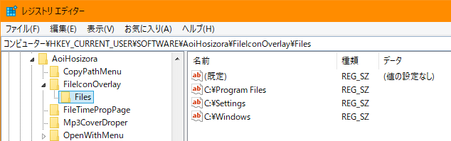
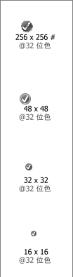

# FileIconOverlay

+ A Windows extension that used to show file icon overlay through registry setting.
+ Environment: `Windows 10 20H2 x64` `Visual Studio 2019` `msvc2019`

### Register

+ Open cmd as administrator, and you may need to remove IconOverlay and restart explorer.exe first.

```bash
Register.bat
# or execute the following commands

regsvr32 x64\Release\FileIconOverlay.dll
```

+ Setup registry for icon overlay handler (This process is not defined in rgs, you have to do it manually).
+ Note that CLSID is set in [FileIconOverlay.idl](./FileIconOverlay/FileIconOverlay.idl) and [FileIconOverlayImpl.rgs](./FileIconOverlay/FileIconOverlayImpl.rgs).

```reg
; Use Register.reg

; You can insert whitespaces on the front of the key name, to increase the priority manually.
[HKEY_LOCAL_MACHINE\SOFTWARE\Microsoft\Windows\CurrentVersion\Explorer\ShellIconOverlayIdentifiers\   AoiHosizoraFileIconOverlay]
@="{7303bbe2-c455-4935-b902-b8095f2738fa}"
```

### Unregister

+ Open cmd as administrator.

```bash
Unregister.bat
# or execute the following commands

regsvr32 /u x64\Release\FileIconOverlay.dll
```

+ Remove icon overlay handler from registry.

```reg
; Use Unregister.reg

; You can insert whitespaces on the front of the key name, to increase the priority manually.
[-HKEY_LOCAL_MACHINE\SOFTWARE\Microsoft\Windows\CurrentVersion\Explorer\ShellIconOverlayIdentifiers\   AoiHosizoraFileIconOverlay]
```

### Setting

+ FileIconOverlay's config is saved in `HKEY_CURRENT_USER\SOFTWARE\AoiHosizora\FileIconOverlay`.

```reg
; Use DemoIcon.reg to add demo icon settings

[HKEY_CURRENT_USER\SOFTWARE\AoiHosizora\FileIconOverlay]
"Icon"="\"E:\\Icon.ico\""
"Priority"="0"

[HKEY_CURRENT_USER\SOFTWARE\AoiHosizora\FileIconOverlay\Files]
"C:\\Windows"=""
"C:\\Settings"=""
"C:\\Program Files"=""
```

+ `Icon` - Overlay icon file
    + Once you reset this value, you have to restart explorer.exe
+ `Priority` - Overlay icon priority
    + Priority must be in ranging from 0=Highest to 100=Lowest
+ `Files` - Files setting, key names are the filepaths which you want to add the overlay icon
    + You can update the key names dynamic, settings will take effect automatically

### Screenshots

||||
|---|---|---|

### References

+ [How to overlay an icon over existing shell objects in 3 easy steps](https://www.codeproject.com/Articles/7484/How-to-overlay-an-icon-over-existing-shell-objects)
+ [.NET Shell Extensions - Shell Icon Overlay Handlers](https://www.codeproject.com/Articles/545781/NET-Shell-Extensions-Shell-Icon-Overlay-Handlers)
+ [apriorit/IconOverlayHandler OverlayIconExt.cpp](https://github.com/apriorit/IconOverlayHandler/blob/master/src/ShellExtensionExample/OverlayIconExt.cpp)
